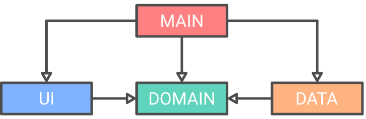

# 
A [logbook](https://en.wikipedia.org/wiki/Logbook) is a record of important events in the management, operation, and navigation of a ship.

I was first introduced to logbooks through the book 100 Days Between Sea and Sky by [Amyr Klink](https://en.wikipedia.org/wiki/Amyr_Klink).

Amyr is a Brazilian sailor that was the first person to row across the South Atlantic from Africa to Brazil.

The use of logbooks was extremely important in the day-to-day travel of Amyr. Inspired by this, I got in the habit of recording my daily activities in simple text files.
This app is the result of automating this habit.

## How it works
When executed, after the user selects a root directory, a new directory will be generated for the current year and month with an empty text file corresponding to the current day. At the end, text file will be opened.

If the directory structure and text file already exists, nothing new will be generated and the current text file will be opened.

## Built with
* [MVP](https://en.wikipedia.org/wiki/Model-view-presenter) ∙ A architectural pattern used for building user interfaces.
* [JUnit](https://junit.org/) ∙ A Java Testing Framework.
* [Mockito](https://site.mockito.org/) ∙ A Java Testing Framework that allows the creation of test double objects in automated unit tests.

## Architecture
Based on the principles of [Clean Architecture](https://blog.cleancoder.com/uncle-bob/2012/08/13/the-clean-architecture.html), the app has been divided into 4 layers: Main, UI, Data and Domain.

* Main is responsible for starting the app and inject dependencies. It depends on all layers.
* UI contains all the presentation rules. It only depends on the Domain layer.
* Data contains all the data access rules. It only depends on the Domain layer.
* Domain contains all the business rules. It doesn't depend on any layer.

## Principles
* [Clean Code](https://www.amazon.com/Clean-Code-Handbook-Software-Craftsmanship/dp/0132350882) ∙ A book on best practices for writing clean, testable, and maintainable code.
* [Clean Architecture](https://www.amazon.com/Clean-Architecture-Craftsmans-Software-Structure/dp/0134494164) ∙ Similar to Clean Code, Clean Architecture is a book on best practices for building clean, testable, and maintainable architectures.
* [Minimalism](https://visme.co/blog/minimalist-graphic-design/) ∙ The main idea in minimalist design is to say more by showing less. Minimalist design is clean and timeless. Only the absolutely necessary is included to get the message across.
